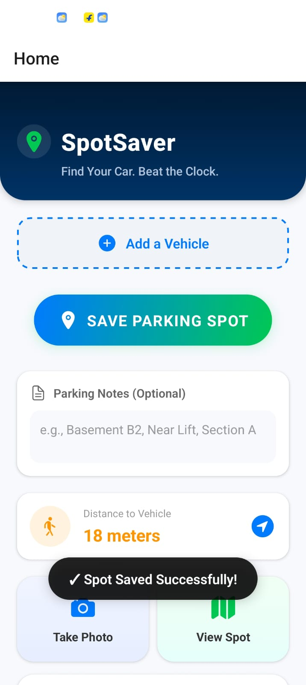
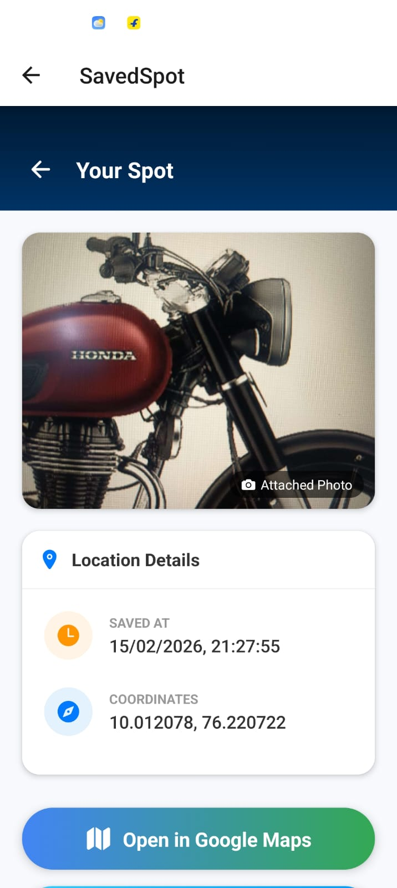
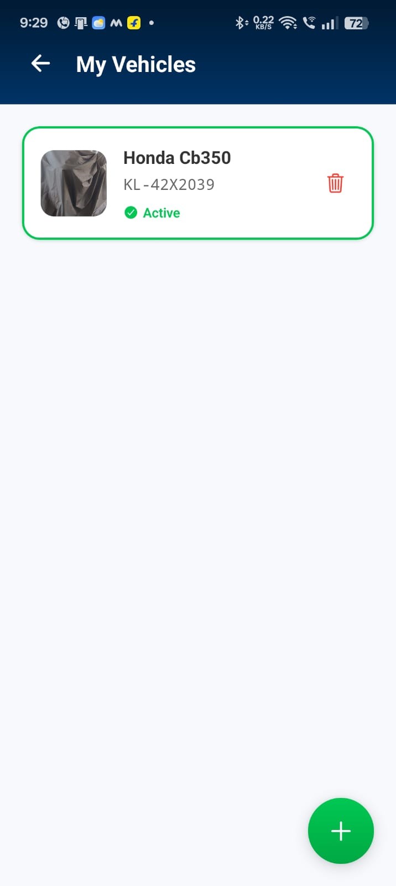
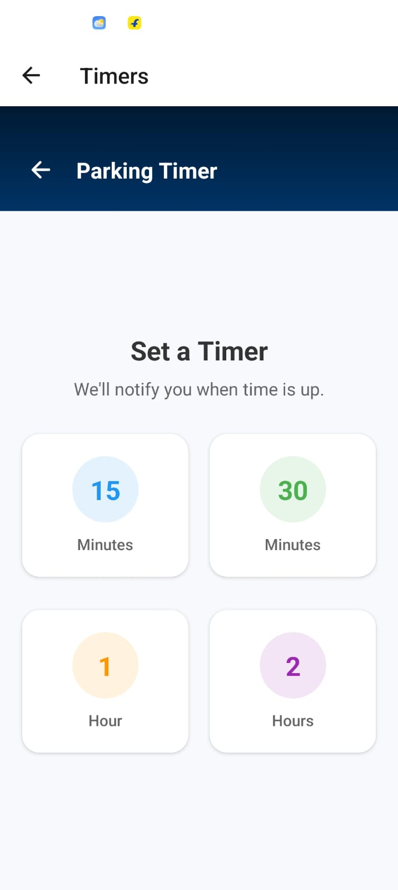

<div align="center">

# 🚗 SpotSaver

### Find Your Car. Beat the Clock.

*Never forget where you parked again*

[](https://expo.dev/)
[](https://www.typescriptlang.org/)
[](https://reactnative.dev/)
[](https://opensource.org/licenses/MIT)

[📱 Download APK](https://expo.dev/artifacts/eas/gmqXyZeuFE7VSBcZr46o11.apk) • [🐛 Report Bug](https://github.com/Hafiz-alt/spotsaver/issues) • [✨ Request Feature](https://github.com/Hafiz-alt/spotsaver/issues)

</div>

---

## 🎯 The Problem

We've all been there:
- 🏢 **Lost in massive parking lots** - "Was it Level 3 or Level 4?"
- ⏰ **Parking meter anxiety** - Rushing back before the time expires
- 🚙 **Multiple vehicles** - "Which car did I take today?"
- 📸 **Forgetting landmarks** - "Was it near the red pillar or the elevator?"

**SpotSaver solves this.** One tap to save your spot, photo, and notes. Set a timer. Find your way back. Simple.

---

## ✨ Features

### 🎯 Core Features
- **📍 One-Tap Save** - Save your parking location with GPS coordinates
- **📸 Photo Capture** - Attach photos of your parking spot or surroundings
- **📝 Smart Notes** - Add custom notes like "Basement B2, Near Lift"
- **⏱️ Parking Timers** - Set countdown timers with notifications
- **🗺️ Navigate Back** - Get directions to your saved spot
- **📜 History** - View all your past parking locations

### 🚗 Vehicle Management
- **Multi-Vehicle Support** - Track parking for multiple cars
- **Vehicle Photos** - Add photos and plate numbers for easy identification
- **Active Vehicle** - Auto-tag parking spots with your current vehicle

### 🤖 Smart Features
- **Auto-Detect Parking** - Optional motion-based parking detection
- **Distance Tracking** - Real-time distance to your parked car
- **Offline First** - Works without internet connection

### 🔒 Privacy First
- **100% Local Storage** - All data stays on your device
- **No Analytics** - Zero tracking or data collection
- **No Account Required** - No sign-up, no cloud sync

---

## 📱 Screenshots

<div align="center">

| Home Screen | Save Spot | History |
|:-----------:|:---------:|:-------:|
|  |  |  |

| Vehicle Management | Parking Timer |
|:------------------:|:-------------:|
|  |  |

*Replace placeholder .txt files with actual .png screenshots*

</div>

---

## 🛠️ Tech Stack

### Frontend
- **React Native** - Cross-platform mobile framework
- **Expo SDK 52** - Development platform and tooling
- **TypeScript** - Type-safe development
- **React Navigation** - Native navigation

### Core Libraries
- **expo-location** - GPS and geolocation
- **expo-camera** - Photo capture
- **expo-notifications** - Local notifications
- **@react-native-async-storage/async-storage** - Local data persistence
- **expo-haptics** - Tactile feedback

### Development
- **Jest** - Unit testing
- **ESLint** - Code linting
- **TypeScript** - Static type checking

---

## 🏗️ Architecture Highlights

### Modular Service Layer
```
src/
├── services/
│   ├── storage.ts       # AsyncStorage abstraction
│   ├── camera.ts        # Image capture & compression
│   ├── autoSave.ts      # Smart parking detection
│   └── notifications.ts # Timer notifications
├── models/
│   ├── Spot.ts          # Parking spot type
│   └── Vehicle.ts       # Vehicle type
└── screens/
    ├── HomeScreen.tsx
    ├── SavedSpotScreen.tsx
    └── VehicleScreen.tsx
```

### Key Design Decisions
- **Type-Safe Models** - Full TypeScript coverage
- **Storage Migrations** - Schema versioning for data integrity
- **Error Boundaries** - Graceful error handling
- **Performance Optimized** - Image compression, batched storage operations
- **Offline First** - No network dependency

---

## 🔒 Privacy & Permissions

SpotSaver is designed with **privacy as a priority**:

| Permission | Purpose | When Used |
|------------|---------|-----------|
| 📍 **Location** | Save parking coordinates | Only when saving a spot |
| 📸 **Camera** | Attach photos to spots | Only when you take a photo |
| 🔔 **Notifications** | Parking timer alerts | Only when timer is active |

**All data is stored locally on your device.** No cloud sync, no analytics, no tracking.

See [PRIVACY_POLICY.md](./PRIVACY_POLICY.md) for full details.

---

## 🚀 Getting Started

### Prerequisites
- Node.js 18+ and npm/yarn
- Expo CLI: `npm install -g expo-cli`
- For Android: Android Studio or physical device
- For iOS: Xcode (macOS only) or physical device

### Installation

1. **Clone the repository**
   ```bash
   git clone https://github.com/Hafiz-alt/spotsaver.git
   cd spotsaver
   ```

2. **Install dependencies**
   ```bash
   npm install
   # or
   yarn install
   ```

3. **Start the development server**
   ```bash
   npx expo start
   ```

4. **Run on device/emulator**
   - Press `a` for Android emulator
   - Press `i` for iOS simulator (macOS only)
   - Scan QR code with Expo Go app on your phone

### Building for Production

**Android APK:**
```bash
eas build --platform android --profile preview
```

**Production Build:**
```bash
eas build --platform android --profile production
```

See [EAS Build documentation](https://docs.expo.dev/build/introduction/) for more details.

---

## 🧪 Testing

Run the test suite:
```bash
npm test
```

Run tests in watch mode:
```bash
npm test -- --watch
```

---

## 🗺️ Roadmap

### ✅ Completed
- [x] Core parking spot save/retrieve
- [x] Photo capture and compression
- [x] Multi-vehicle support
- [x] Parking timers with notifications
- [x] Smart auto-detect parking
- [x] Performance optimizations (~80% faster saves)

### 🚧 In Progress
- [ ] Map view with saved spots
- [ ] Export parking history
- [ ] Dark mode support

### 💡 Future Ideas
- [ ] Share parking location with friends
- [ ] Parking lot occupancy tracking
- [ ] Integration with parking payment apps
- [ ] Apple Watch companion app
- [ ] Widget support

---

## 🤝 Contributing

Contributions are welcome! Please read [CONTRIBUTING.md](./CONTRIBUTING.md) for guidelines.

1. Fork the repository
2. Create your feature branch (`git checkout -b feature/AmazingFeature`)
3. Commit your changes (`git commit -m 'Add some AmazingFeature'`)
4. Push to the branch (`git push origin feature/AmazingFeature`)
5. Open a Pull Request

---

## 📄 License

This project is licensed under the MIT License - see the [LICENSE](./LICENSE) file for details.

---

## 👨‍💻 Author

**Hafiz**
- MCA Student | Mobile App Developer
- Building real-world solutions for everyday problems
- 📧 Email: [your-email@example.com](mailto:your-email@example.com)
- 💼 GitHub: [@Hafiz-alt](https://github.com/Hafiz-alt)

---

<div align="center">

### ⭐ Star this repo if you find it helpful!

**Made with ❤️ for everyone who's ever lost their car in a parking lot**

</div>
